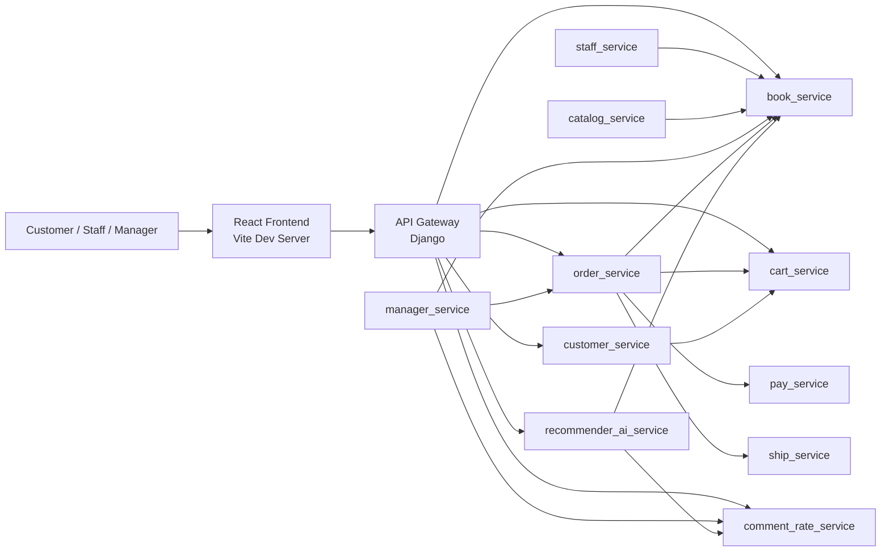

# Bookstore Microservice Architecture

## Overview

This project implements a bookstore system using Django microservices, Django REST Framework, REST-based inter-service communication, and an API gateway used as the single entry point for frontend API calls.

## System Diagram

## Service Responsibilities

### api_gateway
- Single entry point for frontend API calls.
- Proxies `/api/book`, `/api/customer`, `/api/cart`, `/api/order`, `/api/review`, and `/api/recommend` to downstream services.
- Keeps frontend independent from backend service topology.

### book_service
- Stores and exposes book data.
- Supports book list, book detail, create, update, and delete operations.

### customer_service
- Handles customer registration and login.
- Automatically creates a cart when a new customer registers.

### cart_service
- Manages carts and cart items.
- Supports create cart, add item, update quantity, remove item, and get cart by customer.

### order_service
- Creates orders from a customer's cart.
- Calls payment and shipping services after order creation.
- Returns order history by customer.

### pay_service
- Receives payment requests from order_service.
- Stores payment method and charge result information.

### ship_service
- Receives shipment creation requests from order_service.
- Stores shipping method and shipment state.

### comment_rate_service
- Stores ratings and reviews for books.
- Supports review list and review list by book.

### recommender_ai_service
- Generates recommendation lists for a customer.
- Uses data from book_service and comment_rate_service.

### staff_service
- Supports staff-facing book management workflows.
- Uses book_service as the source of truth.

### manager_service
- Provides dashboard/report style data for managers.
- Aggregates data from book_service, order_service, and comment_rate_service.

### catalog_service
- Supports category and catalog views.
- Works with book data to organize browsing structures.

## Key Functional Flows

### 1. Registration creates cart
1. Customer submits registration.
2. customer_service creates the customer.
3. customer_service sends a REST call to cart_service.
4. cart_service creates an empty cart for that customer.

### 2. Add to cart and update cart
1. Frontend calls api_gateway.
2. api_gateway proxies to cart_service.
3. cart_service creates or updates cart items.

### 3. Order triggers payment and shipping
1. Customer submits checkout from frontend.
2. api_gateway proxies to order_service.
3. order_service reads cart data.
4. order_service calls pay_service and ship_service.
5. order_service returns the created order and downstream results.

### 4. Review and recommendation flow
1. Customer submits a review through comment_rate_service.
2. recommender_ai_service reads review summary and book data.
3. Frontend requests recommendations through api_gateway.

## Database Strategy

In the Docker deployment, each service owns its own PostgreSQL database. This preserves data independence between services and avoids direct cross-service table sharing.

## Deployment View

The provided Docker Compose configuration starts the frontend, API gateway, PostgreSQL server, and backend services independently, each on its own port and connected by a shared Docker network.