# Service Architecture Diagrams

This document provides a focused architecture view for each service in the bookstore system.

## 1. api_gateway

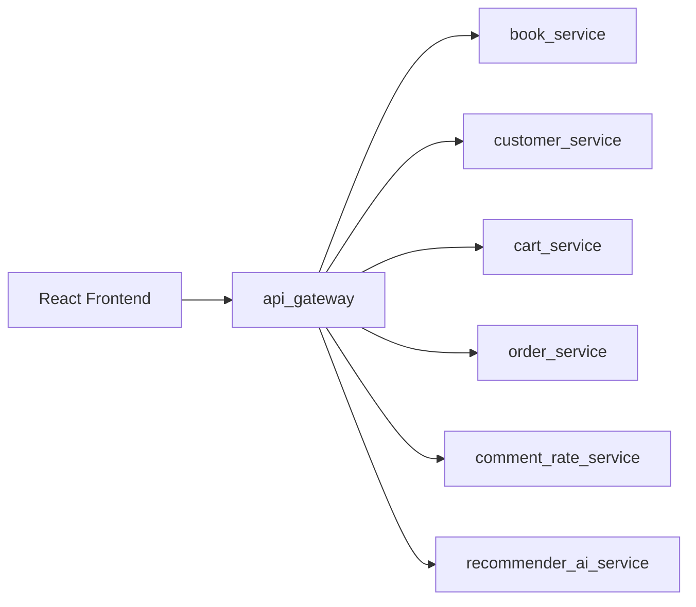

## 2. book_service

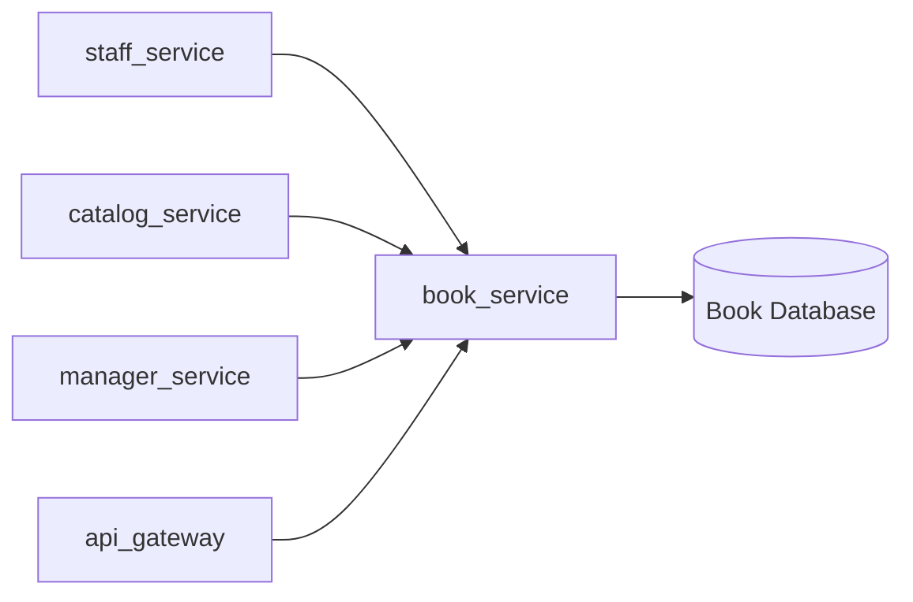

## 3. customer_service

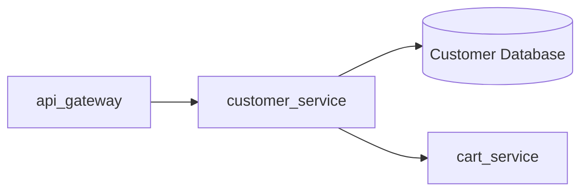

## 4. cart_service

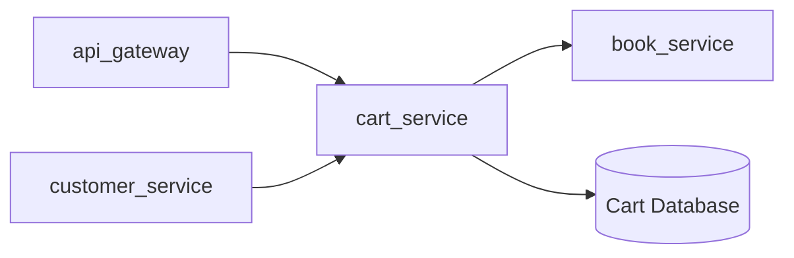

## 5. order_service

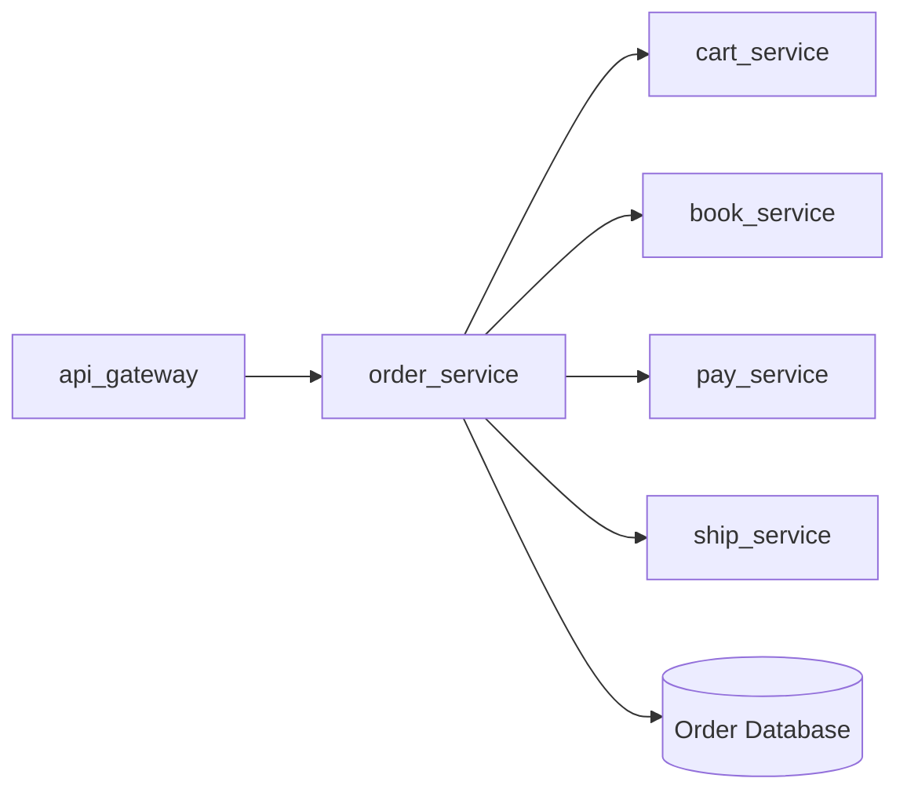

## 6. pay_service

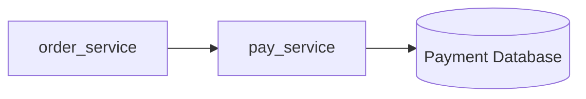

## 7. ship_service

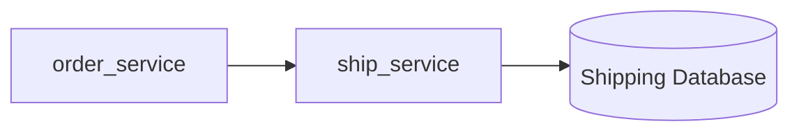

## 8. comment_rate_service

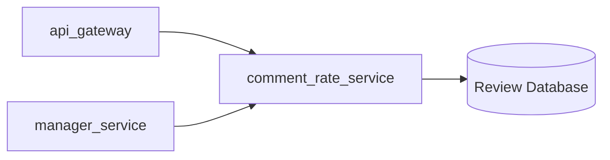

## 9. recommender_ai_service

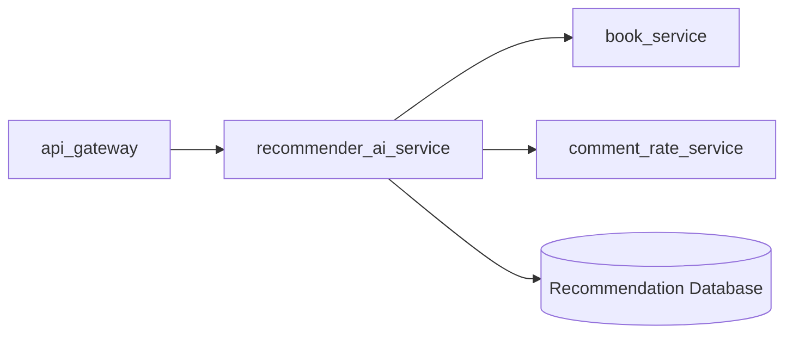

## 10. staff_service

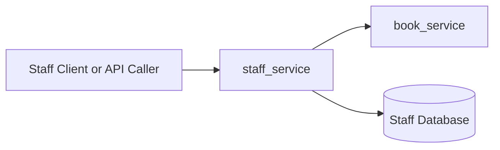

## 11. manager_service

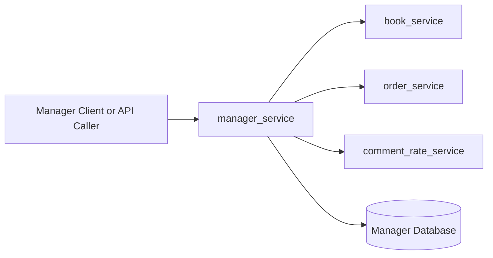

## 12. catalog_service

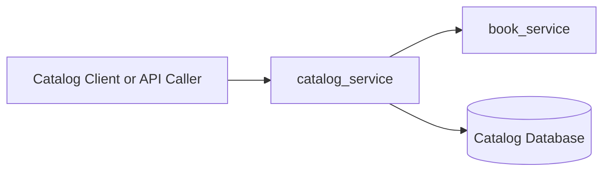